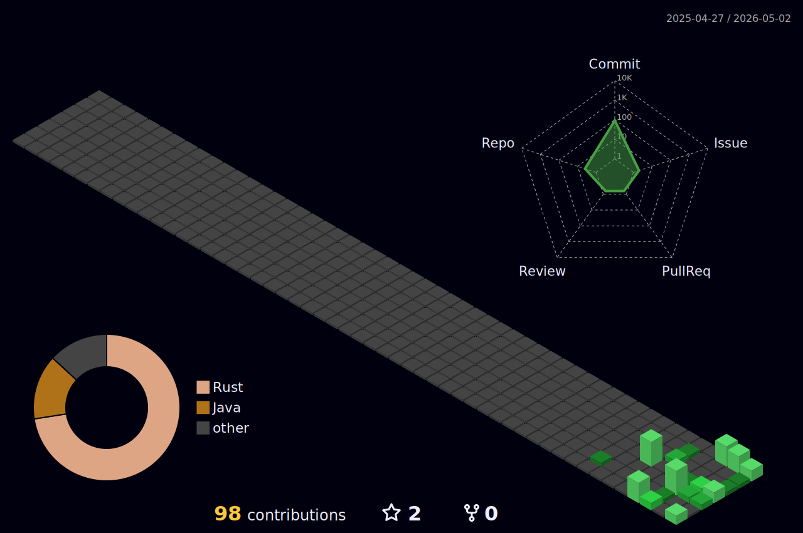

# Hey, I'm MahiroJV 👋

> Hobby developer who tinkers with Linux, breaks things on purpose, and occasionally fixes them.

---

## 🧪 What I'm about

I'm not here to build the next startup — I'm here to have fun, learn stuff, and see how deep the rabbit hole goes.

- 🐧 **Linux** is my playground
- ☕ **Learning Java** — building real projects, not just tutorials
- 🦀 **Learning Rust** - building fan-made projects
- 🛠️ **Shell scripting** — if I can automate it, I will
- 🚀 **Curious about DevOps & CI/CD** — pipelines, containers, the whole thing
- 🗺️ Working through projects on **[roadmap.sh](https://roadmap.sh)** one by one

---

## 🔨 Projects

| Project | What it is | Built with |
|---|---|---|
| [TaskTrackerCLI](https://github.com/MahiroJV/TaskCLIProject) | CLI task manager, no libraries, raw Java | ,  |
| [Kctop](https://github.com/MahiroJV/kctop)| System Monitor, Rust editon, | , |
| [Git-tree](https://github.com/MahiroJV/git-tree)| Git repos visual view | ,
> More coming as I work through roadmap.sh 👀

---

## 🧰 Tools I use

---

## 📍 Right now

- 🌱 Getting comfortable with Java
- 🔭 Exploring DevOps & CI/CD tooling
- 📦 Building projects from [roadmap.sh](https://roadmap.sh) for fun

---

*This whole GitHub is just me experimenting. Nothing is serious. Everything is intention

